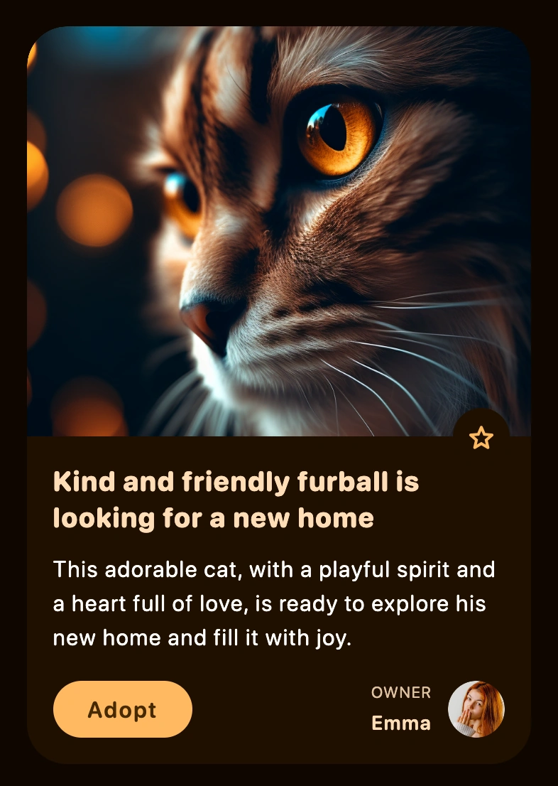

Building consistent and responsive user interfaces can be a daunting task. To address this, I've developed a design system and a components library named `U`. During its development I focused on innovating and creating unique solutions to the needs of my learning platform called `Unni` to make it stand out and convey its unique identity.

### Features of the `U` System:

- Adaptive Color Palette: This feature generates unique color schemes based on user content, providing a personalized experience.
- Harmonious Motion: This integrates animated feedback for users, which is not only performant but visually appealing.
- Fluid Responsive Design: I've implemented design patterns such as fluid typography and spacing, simplifying the development of responsive interfaces.
- Maximized Performance: By steering clear of CSS-in-JS, the system ensures top-notch runtime performance and a reduced bundle size.

## Diving into the Color Palette

The `Unni` application allows users to write rich content including essays, interactive tests, and tasks. I wanted the users to feel like co-creators. They can decorate their content with appropriate images. I then use these images to generate a unique color palette, enhancing their content.

<div class="grid" />

<video src="colors.mp4" alt="Dynamic application recoloring" />

<div class="col" />

Here's a step-by-step description on how the palette generation algorithm works:

1. Firstly, I quantize the image, reducing its colors to a smaller, manageable set.
2. Then, I score these colors based on their vibrancy and how much of the image they cover. I can also filter out any colors that are nearly monochrome at this step.
3. The color with the highest score becomes the source color, defining the overall color scheme.
4. I then generate the remaining colors in the palette in compliance with the WCAG standard to ensure optimal contrast.
5. Lastly, auxiliary colors are adjusted to be visually appealing. For example, if the source color is cool, error and success colors are shifted to cooler hues.

<div class="end" />

<div class="grid" />

3D illustrations can engage users and add appeal to the application. But recoloring them can be a challenge. To do this, I follow these steps:

1. Create a luminance map to assess the brightness of each pixel in the illustration.
2. Apply a mask of the desired color to this map.
3. Merge the colors from the luminance map and the mask.

Since different illustrations may require different approaches, I built a tool that lets me upload an illustration and select the best method for it. This tool has a built-in algorithm that provides suggestions on the best recoloring methods based on color properties e.g. contrast. It also lets users manually tweak the settings for more control.

<div class="col" />

<video src="illustrations.mp4" alt="Dynamic images recoloring" />

<div class="end" />

## Implementing Motion

<div class="grid" />

<video src="buttons.mp4" alt="Micro-interactions" />

<div class="col" />

Since interface elements' colors are content-dependent, providing feedback through color change is not always an option. So, I use resizing: interactive components get bigger when users hover over them and smaller when clicked. However, animating this could cause performance issues or visual flaws.

To solve this, I turned to variable fonts. These fonts contain multiple variations in a single file and allow manipulation of various elements such as weight, width, style, and optical size. Variable fonts can be easily animated, making them perfect for this purpose.

The smooth and precise animations of variable fonts enhance the responsiveness of the interface, boosting overall user engagement. This method combines aesthetics and functionality, enriching the user experience while efficiently addressing potential performance issues.

<div class="end" />

<div class="grid" />

For complex scenarios, I use view transitions—animations for when elements appear, reorder, or disappear. These transitions help reduce cognitive load and perceived latency. The challenge, however, lies in the performance trade-off for animating layout properties.

FLIP (First, Last, Inverse, Play) helps solve this. It's a technique that animates layout changes using "fast" CSS property such as `transform`. FLIP measures the state before and after a property changes (First and Last), rolls back the state (Inverse), and then animates the change (Play).

The real beauty of this technique lies in its efficiency; since most browsers can offload transform animations to the GPU, it's significantly faster and more performance-friendly than animating layout properties directly. This means less jank and a more fluid user experience.

<div class="col" />

<video src="animations.mp4" alt="Layout animations" />

<div class="end" />

## Achieving Responsiveness

Responsiveness is key in modern web development. To ease the development of responsive layouts, I employ fluid sizing for typography and spacing. This allows font sizes to adjust dynamically based on the viewport size, ensuring that your content is readable across different devices.

To further simplify this process, I've created opinionated wrappers around Flexbox and Grid. These wrappers can implement responsive patterns such as resizable cards grids that adjust both card widths and column counts, thereby reducing the amount of boilerplate code that needs to be written.

## Prioritizing Performance

Although CSS-in-JS can offer certain benefits, it adds runtime overhead. Each time components render, a CSS-in-JS library has to translate their styles into plain CSS to insert into the document. This forces the browser to do additional work, affecting performance.

To avoid this, I prefer using utility CSS classes for styling components. This approach accelerates development by simplifying code structure and reducing complexity. Inspired by Tailwind, I've developed a fully-typed customization system for my components. This system also includes property shorthands and bundles that help to write more concise and more readable CSS.

In the example below, I specify an orange color as the source and it derives new colors for buttons, text, background for a card.

```xml
<Recolor source="#f99f04" w100 w={400} p="s24" e0>
  <D w100 r28 noScroll>
    <D relative>
      
      <D absolute bottom="0" y="50%" right="s16" rCircle e2>
        <IB icon="star" />
      </D>
    </D>
    <D e2 p="s20">
      <T bold mb="s12">
        Kind and friendly furball is looking for a new home
      </T>
      <T lb mb="s20" tWhite>
        This adorable cat, with a playful spirit and a heart full of love,
        is ready to explore his new home and fill it with joy.
      </T>
      <S spaceBetween>
        <B text="Adopt" filled />
        <S s12>
          <S v s4>
            <T ls tSec upper>
              owner
            </T>
            <T lm semi>
              Emma
            </T>
          </S>
          
        </S>
      </S>
    </D>
  </D>
</Recolor>
```

<div class="grid" />



<div class="col" />

The library takes advantage of the power of custom CSS variables. This allows it to change the appearance of web components in a performant way when the source color changes. The source color is stored in DOM tree. From there, my library takes over to generate and apply a variety of tints and shades to a subtree. Therefore, a single change to a CSS variable, such as the the source color, can result in a ripple of changes throughout the entire UI, creating a truly dynamic and responsive design.

<div class="end" />

```u cards
to: lean_language_learning
title: Application
description: Read about how I used this library to build a product for efficient learning

to: edge_baas
title: Backend
description: Read about my edge-first fullstack framework for cheap data storage

to: efficient_development_environment
title: Development
description: Learn how I organized my development to get feedback blazing fast
```
