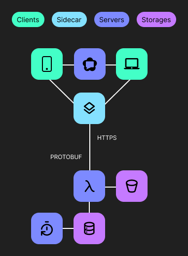

In this article, I will be showcasing my offline-first, full-stack framework that makes developing web applications quick and straightforward. This framework comes with a variety of tools to implement:

- Real-time data queries
- Efficient file uploads
- Secure authorization
- Full text search
- Push notifications

Features

- Low operational cost: Leveraging client-side caching and edge hosting, this framework is economical and won't drain my budget.
- Low development cost: By implementing full-stack type safety, the framework allows for more efficient and safer code writing.
- Great developer experience: The framework allows immediate feedback during development, reducing the need for backend mocking.

I will demonstrate how to use this framework with Node.js as the backend and Cloudflare as the cloud provider. To keep server costs low, I chose Cloudflare, as a more affordable and straightforward alternative to AWS. All their services run on the edge, near the users, which helps reduce response times. However, there is no vendor lock-in, so I can host the backend of the framework as I want.

For client dependencies, I utilize TanStack libraries that offer adapters for different frontend frameworks. My goal is to minimize lock-in, making it easier to migrate or refactor my application in the future. In the examples below I use React.

## Motivation

Over the past 5 years, I have been experimenting with various technologies to find the perfect toolkit for easy and cost-effective development of applications with modern UX.

I developed this framework as an alternative to Next.js, AWS Amplify, Firebase, etc., with a focus on minimizing server costs. It is designed to be used with PWAs (Progressive Web Apps) as the primary clients. The main goal during development was to have as few abstractions and dependencies as possible.

I used this framework to build my learning platform `Unni`, which focuses on personal knowledge management. I plan to open-source the framework alongside the platform and a few other libraries that further improve the developer experience.

## Real-time data queries

<div class="grid" />

Let's start with an architectural overview. Clients communicate with edge functions through a sidecar process that runs parallel to the main application. This sidecar process manages server interactions and data synchronization. It retrieves data from the local cache if there have been no changes to the server data to avoid unnecessary requests. A Bloom filter is used to detect any alterations.

Large data that doesn't change often is stored in an object storage system, while user-generated mutations are temporarily stored in a relational database. A scheduled task merges these mutations with the data in the object store. Protocol buffers are used to optimize the storage and reading of large objects.

Data that changes frequently or requires complex queries is stored in the database.

<div class="col" />



<div class="end" />

The `WebRTC` protocol allows for real-time collaboration. Merge conflicts are resolved using a specialized mutation structure, and `CRDT` (Conflict-free Replicated Data Types) is employed for more intricate conflict resolution.

### Client

The main goal when designing the querying API was to make it as simple as possible. Ideally, interactions with a remote database should be as easy as interacting with an in-memory variable.

Here's an example of a basic query that retrieves a cat by its ID within a component:

```tsx
function Cat({ id }: CatProps) {
  const [cat, setCat, status] = useRow('cat', id)
  return ... // render UI
}
```

This internally uses `suspense`, so if an error occurs, the component won't render. The status parameter can be used to show in the UI that data is synchronizing if it was read from the client's cache.

To modify data, I can call the `set` function with a data patch:

```tsx
const setOwner = (owner: Owner) => setCat({ owner: { owner } })
const deleteOwner = () => setCat({ owner: null })
```

You can pass `null` to delete a portion of the data or the entire row.

The `set` function creates a mutation that optimistically updates the UI. If there are other queries depending on the cat table, they will be refetched.

For example, another component might request a list of cities using the following query:

```tsx
const [cats, status] = useRows({
  table: 'cat',
  select: ['name', 'breed'],
  where: [
    ['origin', '==', 'Germany'],
    ['age', '>', 2],
  ],
  order: ['age', 'desc'],
  join: { table: 'toy', as: 'toys' },
})
```

The querying API is designed for frequent SQL queries. For more complex scenarios, a dedicated solution like an ORM should be used, and data querying should be moved to the server.

To avoid making multiple sequential requests to the server, more advanced hooks like `useTables` are available.

Querying is integrated with the client-side router to start fetching data as early as possible. For example, when a user hovers their mouse over a link or button, fetching starts after 50 ms.

### Server

To prevent security vulnerabilities, rules can be implemented that run before each query on the server:

```tsx
const securityRules: Rules = {
  cat: async ({ user, query, db }) => {
    if (query.type === 'read') return
    if (!user.roles.includes('editor')) throw new Error('Not an editor')
    if (query.data?.age > 20) throw new Error('Age is too high')
    if (query.data.owner) {
      const oldOwner = await db.get('cat', query.data.id)
      if (oldOwner) throw new Error('Owner cannot be changed')
    }
  },
}
```

Furthermore, incoming queries are sanitized to prevent SQL injections. The `user` argument in a rule is a JWT token payload signed by an authorization service.

The data is stored as JSON in an SQL database, specifically D1. D1 is a Cloudflare SQLite-compatible database that runs on the edge. It is synchronized with a client-side WebAssembly-based SQLite. This allows me to share most of the implementation between the client and server. I model data using data classes. I don't need to use tRPC or GraphQL to achieve full-stack type safety because the client and server share these classes. The entry point of the query server is an edge function that runs on Cloudflare Workers. It has zero-time cold starts.

## Efficient File Upload

When users upload files, they should be optimized to reduce their size. For example, images are converted to the `avif` format. Additionally, a placeholder is generated as part of the image URL, which is displayed while the actual image is loading.

<div class="grid" />


<div class="col" />


<div class="end" />

All of this processing takes place in a separate thread on the client using WebAssembly-compiled `avif` codecs.

There is also convenient caching control based on resource type and size. As a result, files are available in offline mode, and if a file is uploaded without an internet connection, the upload will restart when connectivity is restored. Preloading is available as well.

For some files, an undo-delete feature can be implemented. In this case, a file is marked as ready for deletion. The deletion occurs after a specified time, during which the file can be restored.

This file management has a simple client API:

```tsx
const { upload, progress, isUploading } = useUpload()
```

The `upload` function returns an ID that is used to access the uploaded file:

```tsx
function Image({ id }: ImageProps) {
  return  remove(id)} />
}
```

## Full Text Search

To implement full text search on the edge runtime and in offline mode, I use the `orama` full-text search engine. It is a powerful and flexible engine with a WebAssembly implementation for efficient searching. I store search indexes in the object store and distribute their updates using mutations in the same way I described in the section about data queries above.

## Push Notifications

To send push notifications, I use the Google Messaging service because it is free. However, to interact with it, a cloud function must be deployed since their SDK doesn't support the edge environment.

## Authorization

The authorization service generates JWT tokens that are verified when clients use other services. Additionally, this service stores sensitive user data in GDPR-compliant storage and tracks their activity (e.g., when they last logged in).

Client-side hooks provide the ability to log in without a password by email:

```tsx
function Component() {
  const { isLoggedIn, loginWithEmail } = useLogin()
  const { user } = useUser()
  if (!isLoggedIn) return <button onClick={loginWithEmail} />
  return <div>{user.name}</div>
}
```

```u cards
to: lean_language_learning
title: Application
description: Read about how I used this library to build a product for efficient learning

to: crafting_unique_ui_experiences
title: Frontend
description: Learn how I built my performant and colorful component library

to: efficient_development_environment
title: Development
description: Learn how I organized my development to get feedback blazing fast
```
