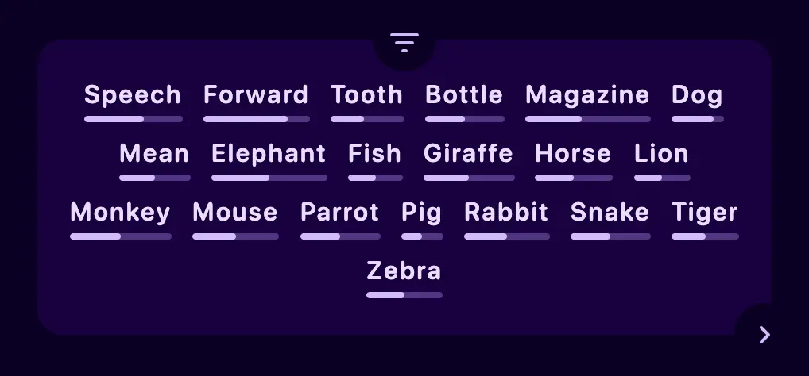

This article describes the results of my five-year experiment in augmenting human thought with computer systems to enhance learning. I demonstrate a prototype of my AI-powered learning platform and explore how it can be used to help people learn languages more effectively.

## Problem

The global market for language learning apps is growing due to their affordability and convenience. However, most apps aren't advanced enough for users to become fluent, requiring additional courses. While a small percentage of students use apps, the younger generation increasingly prefers them over live teachers. This puts pressure on tutors who must share income with the platforms they teach on, potentially losing 15-30% of their earnings.

I believe in affordable education for everyone. Therefore, I have built a learning platform that benefits both students and teachers without unethical practices. This platform, which uses modern AI models, can be used for language learning and other industries.

## Learning words

The platform helps users learn vocabulary through an interactive process.

<div class="grid">

First, Users add words and context to their vocabulary notebook from sources like movies. Then they search for and add definitions, giving less emphasis to unimportant ones by clicking the broken heart button.

When a definition is added to users' collections, multiple types of flashcards are created.

Main types are:

- Fill: Fill-in-the-blank using a definition or translation
- Grasp: Translate or define a word in context.
- Write: Write the word based on pronunciation.
- Say: Record pronunciation and check correctness

Bonus types are:

- Article: Single-choice questions for noun definitions
- Irregular: Special cards for verbs with irregular forms.

<div class="col">

<video src="words.mp4" alt="User learns 2 definitions">

<div class="end">

In addition, users can add cards with synonyms, antonyms, cognates, and so on, depending on the dictionary's capabilities or their needs.

As users practice the main types of cards, they will hear the correct pronunciation each time.

This set of cards allows to achieve elaborate encoding. The richer the associations users have with a word, the better they will remember it. That is why each definition is accompanied by an image created from the example.

The process for learning phrases is similar, except that only Fill and Grasp cards are used.

There are also image occlusion cards. They can be used to learn parts of a whole or objects in general, for example, to learn the names of body parts or kitchen appliances in a single image.

Pictures are crucial due to the picture superiority effect, which was discovered in 1971 by the psychologist Allan Paivio. He investigated this effect, demonstrating that pictures and words together are often recalled substantially better than words alone.

The app features a game for learning the top 20,000 most frequent words, with progress tracking and recommendations. Teachers can add word cards to their lessons, and for students below B1 level, teachers can create customized learning tracks.



This approach of learning words has been tested for English, German, and Japanese.

### How AI helps students learn words

AI helps students learn words on the platform in various ways:

- AI translates definitions and examples to reduce cognitive load and improve understanding. (Users can practice with or without translations, depending on their confidence level)
- If a word or phrase isn't in the global index, AI extracts information from online dictionaries and generates images, pronunciations, and usage examples.
- AI evaluates pronunciation for Fill and Say cards

Teachers can add word cards to their lessons within the system. If a student's level is below B1, the teacher can create their own word cards so that students are not overwhelmed.

## Memory system and spaced repetition

Memory system and spaced repetition are crucial for learning. Skilled individuals recognize patterns in their field, allowing them to think abstractly and perform better. The platform uses flashcards to present these patterns to novices.

Different card scheduling strategies were explored for spaced repetition. Machine learning-based algorithms showed better performance but reduced user engagement. Users preferred being reminded of forgotten information, which motivated them to use the app.

In the platform, users learn "ideas" through flashcards. An idea is easily communicated information that can be atomic or consist of related entities, like a word with multiple definitions or an algorithm with its steps.

The new scheduler considers several parameters for card order in a training session:

- Priority: Importance of avoiding errors.
- Difficulty: Harder cards need more repetition.
- Card type: Some cards should be sequential, while others can be shuffled.

Parameters are shown as colored circles during training. The scheduler also considers user preferences, like avoiding pronunciation cards in public settings. Personalized difficulty levels based on a student's background are being explored using machine learning.

### UI adaptation for trainings

Priority and complexity can be shown with emoji, but how can the app show at what stage of consolidation a flashcard is in the brain?

<div class="grid" />

The app's UI adapts to show a flashcard's consolidation stage in the brain using an adaptive color palette. Colors range from red (new information) to violet (long-held memory). The entire interface changes color based on the card's consolidation stage.

Difficulty affects repetition frequency, with higher difficulty leading to more repetitions and more colors. Some users intentionally set cards to high difficulty to enjoy the colors.

User interaction presented challenges, such as feedback accuracy and mental exhaustion. To solve these issues, I replaced feedback buttons with gesture control. Touching the card reveals hidden information, swiping left indicates success, and swiping right indicates failure. On computers, arrow keys are used instead of swiping.

<div class="col" />

<video src="colors.mp4" alt="Different colors for a card with medium difficulty">

<div class="end" />

After a training session, users see their stats and receive a trophy based on performance, incorporating gamification elements into the app.

## Learning grammar

To learn grammar on the platform, teachers create interactive essays that convey key ideas, accompanied by a "reflected essay" generated as a set of cards from interactive exercises. This method helps students retain important ideas. Each essay can be considered a 15-30 minute lesson. A collection of such essays, along with occasional extended quizzes, constitutes the course.

<div class="grid" />

<video src="grammar.mp4" alt="User interacts with an interactive lesson">

<div class="col" />

In the video a user opens a lesson, reads through it and then answers questions in the "reflected" essay.

When reviewing exercises, explanations are provided for incorrect answers. As students complete the lesson exercises, statistics are collected, similar to training completion. Courses are integrated with the memory system, and all interactive exercises will be shown as flashcards during spaced repetition.

Redundancy is encouraged to achieve elaborate encoding, helping learners form multiple associations with the taught ideas. When a user forgets the answer to a question: In a typical spaced-repetition memory system, this would be dealt with by decreasing the time interval until the question is revisited.

<div class="end" />

However, it may be more effective to follow up with questions designed to help the user understand some of the surrounding context and ideas.

### How AI helps students learn grammar

The platform allows teachers to create learning tracks that include entire courses, individual exercises, and ideas. These tracks aim to provide personalized training programs that consider a student's level and goals, such as preparing for an exam.

While working with tracks, courses, and ideas, the platform collects statistics for teachers. Machine learning models use this data to make recommendations for content improvement. For example, it can identify areas where many students struggle, suggesting additional explanations. It can also compare student performance and predict outcomes like exam grades.

Students can use these statistics to focus on mistakes and problem areas. Those who prefer to avoid interval repetition can request the system to generate tests for short-term preparation before exams.

The aforementioned activities are described briefly, as each deserves a comprehensive analysis. The description of free-response questions, fill-in-the-blank cards, reflection, peer review, and other feedback methods is also omitted.

When teachers write essays, they can ask the AI to generate questions related to the essay. This simplifies lesson preparation, particularly when creating questions to test students' understanding of a rule in various contexts. Students can also ask the AI to clarify any unclear points in the lesson.

Many students appreciate the ability to translate parts of the lesson into their native language, helping them understand details they might have missed. At times, the AI can simplify or shorten the lesson, although the results depend on the source text.

While attempts have been made to automate the review of free-response questions, there have been challenges with the AI hallucinating and providing inaccurate information. Though this happens infrequently, it is disappointing for students, and they may be hesitant to use this feature, especially during exam preparation.

## Collaboration

Collaborative content creation is the only economically viable solution for organizing a true mnemonic medium. By involving students, teachers, and experts in the process, the workload can be distributed, and a wealth of knowledge can be shared.

Students can participate in learning communities where they collaborate, learn together, and create content for one another. Teachers can also create and manage their communities, working together to develop high-quality materials. Openly available educational content is a significant advantage, as it eliminates the dissatisfaction some students experience when they feel they have wasted money on paid content.

With open access to educational materials, teachers can still earn money through microtransactions and auctions for their services, such as answering questions, providing feedback, and conducting consultations and webinars. Microtransactions offer an affordable option for students, while auctions benefit teachers who can effectively engage with their audience.

Collaborative learning also fosters a sense of community and motivation among students, encouraging them to learn and compete with one another in a healthy and productive manner.

## Business model

The proposed business model offers a competitive edge by focusing on accessibility and affordability, without sacrificing the quality of the platform or the user experience. Here's a summary of the main components of this business model:

- No restrictions on collaborative content creation or personal use of the memory system.
- Teachers and businesses pay $8 per user for access to advanced statistics and features.
- AI interaction is charged separately, based on usage.
- Teachers can use tools for organizing webinars and collecting microtransactions without platform fees.
- The platform is open source and can be deployed locally for non-commercial organizations.

## History

Zero Version (2019): Focused on simple flashcard creation, used for personal IELTS preparation.

Stack: `Java`, `Android UI`, `SQLite`

First Version (2020 - 2021): Allowed users to create and manage different cards and decks, tested with a small group of users.

Stack: `React Native`, `Java (Spring)`, `PostgreSQL`

Second version (2022): Focused on a no-code toolkit for creating interactive lessons and courses, expanded user base, and served as the basis for my thesis.

Stack: `PWA`, `React`, `AWS`

Third Version (2023): Focused specifically on language learning.

Stack: `Next Js`, `Planetscale`

Current Development: Merging the last two versions and migrating to a new stack.

Stack: `PWA`, `React`, `Cloudflare`

```u cards
to: https://www.figma.com/file/a1FeBUTP1wUynV1Y169dz5/Thesis?node-id=0-1
img: folder.webp
title: Thesis
description: See my thesis presentation describing a no-code course creation toolkit
color: #ffc2ca
bg: #33010f

to: https://demo.unni.one/
img: rocket.webp
title: Prototype
description: Try the latest version of the application to explore how it works
color: #dfc8ff
bg: #22023c

to: https://www.figma.com/file/a1FeBUTP1wUynV1Y169dz5/Thesis?node-id=533-2
img: picture.webp
title: Screenshots
description: View screenshots of different versions of the application 2019 - 2023
color: #fac9b7
bg: #2c0900

to: crafting_unique_ui_experiences
title: Frontend
description: Learn how I built my performant and colorful component library

to: edge_baas
title: Backend
description: Read about my edge-first fullstack framework for cheap data storage

to: efficient_development_environment
title: Development
description: Learn how I organized my development to get feedback blazing fast
```
