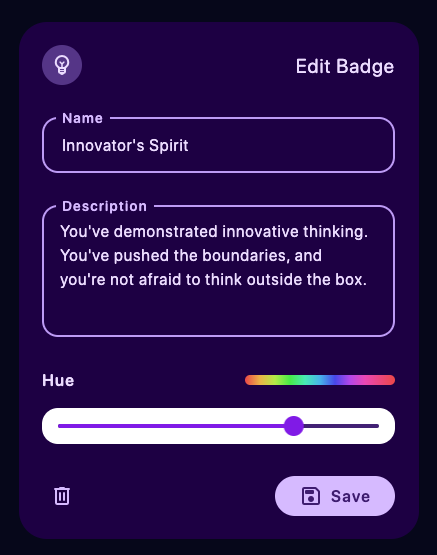

## Formulating the Task

One of the core features of Leapsome is praise and continuous feedback. Let's imagine a product that allows users to send public praise to each other. A praise is simply some text content sent from one user to another.

We can quickly make a wireframe of such a product as follows:
On the user's `Profile` page, there is an inbox that displays a list of received praises. There is also a statistics component that shows 2 parameters: number of sent and received praises.

From the user's page you can navigate to the `Praise Wall` page. It contains public praises in the whole company. There is also a praise create button that opens a modal with two fields: "send to" and "content".

In my case study, I should answer the following questions:

1. From a product perspective, which changes to the product would you implement to accommodate this feature?
2. From a technical perspective, please elaborate on the API and the data model needed to enable this feature.
3. In which ways could this feature potentially evolve? For example, are there ways to generalize the concept of "badges" to serve other purposes? Are there ways to gamify the experience of sending praise?

## Changes to the Product

Primary modifications to the system to integrate badges:

<div class="grid" />

1. The product would need a feature for managers (administrators) to create, and manage badges. Each badge could be named based on the company's core values, have an appropriate color and description. There should also be an option to upload an icon for each badge.

2. Badge Selection in Praise Creation: When a user is sending a praise, there should be an option to select multiple badges to attach to the praise. This could be a drop-down menu or a grid of toggleable buttons (chips).

3. Badge Display in Praises: On the Praise Wall and in the user's inbox, the badges associated with each praise should be displayed alongside the praise.

4. Badge Statistics: The user's profile page should display how many of each badge they have received, in addition to the total number of praises sent and received.

<div class="col" />



<div class="end" />

## Technical Details

Changes to both your API and data:

```tsx
const BadgeSchema = new mongoose.Schema({
  name: { type: String },
  color: { type: String },
  description: { type: String },
  icon: { type: String }, // url to the icon image
})

// reference to these badges in the PraiseSchema
const PraiseSchema = new mongoose.Schema({
  badges: [{ type: mongoose.Schema.Types.ObjectId, ref: 'Badge' }],
})

// add API endpoints to manage badges
app.get('/badges', () => {})
app.post('/badges', () => {})
app.get('/badges/:id', () => {})
app.put('/badges/:id', () => {})
app.delete('/badges/:id', () => {})
```

## Feature evolution

Ways to further evolve and expand the concept of badges to make the platform more engaging and fun:

- Achievement Badges: Apart from the badges given by users, there could be system generated achievement badges. These could be awarded for different milestones like "First Praise Sent", "10th Praise Received", "Received Praise from 5 Different Users", etc.

- Company-Wide Badge Leaderboard: To create some healthy competition and further promote the company values, you might introduce a leaderboard feature. This would show the top receivers of each badge in the company, and possibly the top overall badge earners.

- Use Badges for Access: The badges could also serve a functional role where certain badges could grant access to special content, events, or even permissions within the platform.

- Integration with Professional Development: Badges could be tied to professional development paths in the company, where earning certain badges could demonstrate competence in a specific skill, which in turn could be linked to career progression or learning opportunities.

```u cards
to: lean_language_learning
title: Application
description: Read about my collaborative platform for efficient learning

to: crafting_unique_ui_experiences
title: Frontend
description: Learn how I built my performant and colorful component library

to: edge_baas
title: Backend
description: Read about my edge-first fullstack framework for cheap data storage
```
